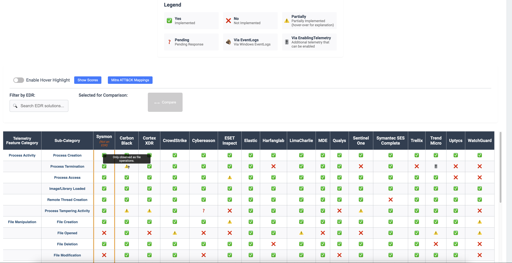

# EDR Telemetry

This repo provides a list of _**telemetry features**_ from EDR products and other endpoint agents such as [Sysmon](https://learn.microsoft.com/en-us/sysinternals/downloads/sysmon) broken down by category. The main motivation behind this project is to enable security practitioners to compare and evaluate the telemetry potential from those tools while encouraging EDR vendors to be more transparent about the telemetry features they do provide to their users and customers.

Besides compliance, investigations and forensics benefits, rich log telemetry empowers cyber defense teams to develop custom hunting, detection and analytics capabilities tailored to their needs.

Read details about this project in the initial release blog post [here](https://detect.fyi/edr-telemetry-project-a-comprehensive-comparison-d5ed1745384b?sk=b5aade1de1afbabf687620a12aa7a581)). 

 

# New Project Website: [**EDR-Telemetry.com**](https://www.edr-telemetry.com)
 
## Telemetry Definition
There are many types of *telemetry* when it comes to Security Instrumentation. Here we focus on agents or sensors generating telemetry in the form of *log data*, regardless of the format (json, key-value, csv), as long as the data is automatically generated and transmitted or streamed in near real-time.

## FAQ & Contributions

Please check our [FAQ](https://github.com/tsale/EDR-Telemetry/wiki/FAQ) page to know more and feel free to get in contact in case you cannot find an answer there.

In case you ware willing to contribute, please check the [Contributions](https://github.com/tsale/EDR-Telemetry/wiki#contribution-guidelines) page.

>**Disclaimer**\
The telemetry of the EDR products below could improve with time. The `last_updated` field is the last time the data sources have been updated. This might NOT always be up to date with the current telemetry capabilities of each product.
>

Telemetry Comparison Table
-----------------------------------

>**Disclaimer**\
The data below do not represent the capability of each of the EDR products to detect or prevent a threat. This is ONLY a comparison regarding the available telemetry for each product. Some products, such as Elastic EDR, make additional telemetry available in free or paid modules. Add-on modules, as well as signals, will not be taken into consideration for this project. Please read more about this on our FAQ page [here](https://github.com/tsale/EDR-Telemetry/wiki/FAQ#7-what-is-the-scope-of-the-telemetry-comparison-table-for-edr-products).

<be>

## EDR Evaluation and Scoring Script

This script evaluates and scores Endpoint Detection and Response (EDR) Solutions based on their capabilities. It reads data from the main JSON file (`EDR_telem.json`), which contains information about various EDRs and their features. The script then calculates a score for each EDR based on the presence and absence of certain features, as well as the category of the feature.

### Scoring Logic
- Each feature and category is assigned a weight.
- The weights represent the importance of the feature or category. For example, a feature with a weight of 1 is considered more important than a feature with a weight of 0.5.
- The compare.py script multiplies the weight of each feature by the weight of its category, adding this product to the EDR's total score.
- If a feature is absent, its weight is considered 0.

This scoring algorithm allows us to quantitatively compare different EDRs based on their capabilities. The higher the score, the more capable the EDR is. The weights can be adjusted as needed to reflect changes in the importance of different features or categories.

For more details, you can refer to the [Pull Request #61](https://github.com/tsale/EDR-Telemetry/pull/61).

**Below is the score assigned to each value currently:**

- No: 0,
- Partially: 0.5
- Pending Response: 0
- Via EnablingTelemetry: 1
- Via EventLogs: 0.75
- Yes: 1

### EDR Scores

| **No.** | **EDRs**              | **Score** |
|---------|-----------------------|-----------|
| 1       | CrowdStrike                 | 37.45       |
| 2       | Sentinel One                 | 34.25       |
| 3       | MDE                 | 34.2       |
| 4       | Uptycs                 | 33.85       |
| 5       | Trellix                 | 30.6       |
| 6       | Harfanglab                 | 30.45       |
| 7       | Cortex XDR                 | 29.65       |
| 8       | LimaCharlie                 | 29.25       |
| 9       | ESET Inspect                 | 28.1       |
| 10       | Qualys                 | 27.45       |
| 11       | Elastic                 | 26.35       |
| 12       | Cybereason                 | 25.65       |
| 13       | Symantec SES Complete                 | 24.3       |
| 14       | Sysmon                 | 23.2       |
| 15       | WatchGuard                 | 20.4       |
| 16       | Carbon Black                 | 20.1       |
| 17       | Trend Micro                 | 19.1       |

## EDR Telemetry Table
Below is information about the EDR table, including all values for each EDR and a description for each attribute.
 

| CSV Values 	| JSON Values               	| Description
|-------	|-----------------------	|-----------------------
| ✅     	| Yes           	        | Implemented
| ❌     	| No       	                | Not Implemented
| ⚠️     	| Partially	                | Partially Implemented
| ❓     	| Pending                	| Pending Response
| 🪵     	| Via EventLogs           	| Collected from Windows Event Logs if enabled at the system level; not independently collected by the EDR via ETW.
| 🎚️     	| Via EnablingTelemetry         	| Additional telemetry collection capability that can be enabled as part of the EDR product but is not ON by default.
 

**References to Documentation for each EDR product:** [Link](https://github.com/tsale/EDR-Telemetry/wiki#product-documentation-references) \
**Website:**[https://edr-telemetry.com](https://www.edr-telemetry.com)

# ✨ Contributors Wall

Thanks to these amazing contributors:

  
  
  
  
  
  
  
  
  
  
  
  
  
  
  
  
  
  
  
  
  
  

## Current Primary Maintainers
Kostas - [@kostastsale](https://twitter.com/Kostastsale)